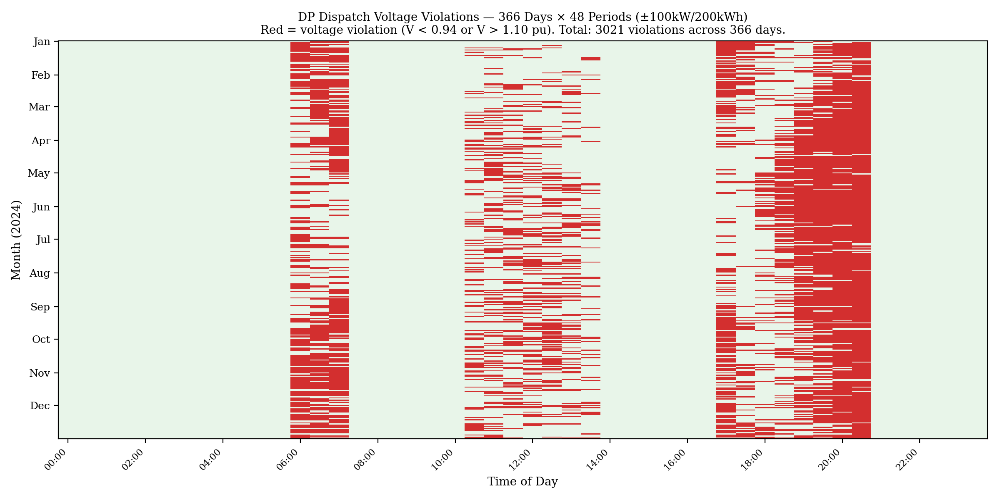
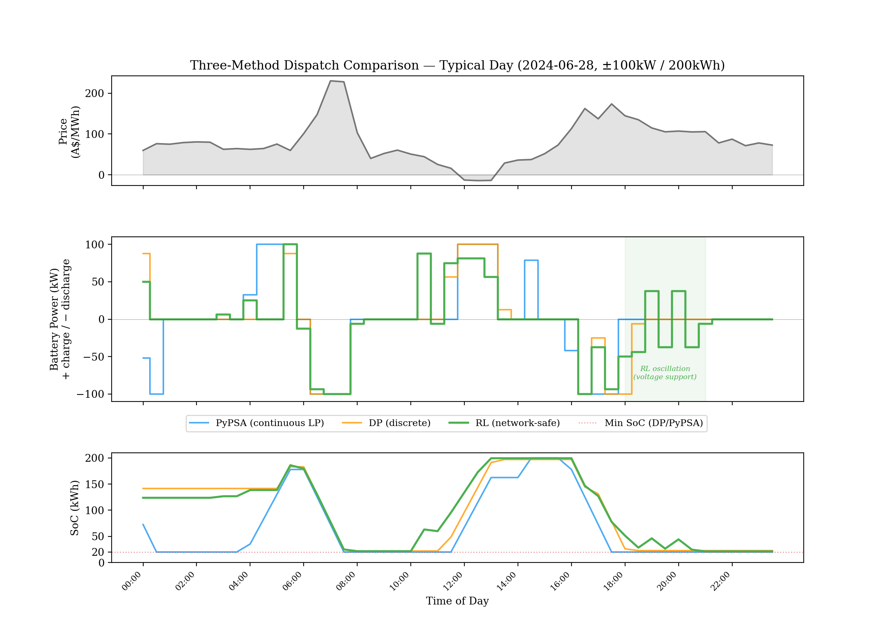
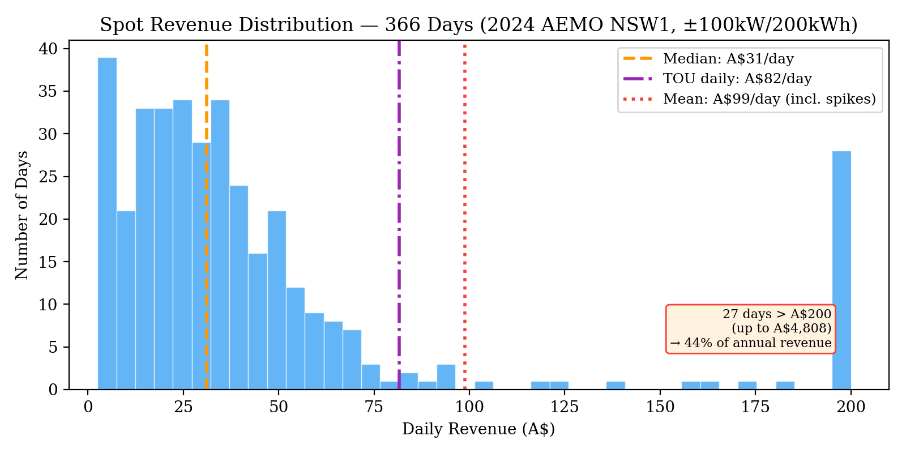

# Community Battery Techno-Economic and Network Analysis

## Overview

Community batteries are shared energy storage systems installed on suburban distribution networks, charging from rooftop solar during the day and discharging during evening peak demand. They provide two forms of value: **arbitrage revenue** (buying electricity when cheap, selling when expensive) and **network support** (preventing voltage violations that would otherwise require costly infrastructure upgrades).

This project builds a decision-support framework that jointly optimises these two objectives using three models: deterministic dynamic programming (DP) for revenue-maximising dispatch, Q-learning (RL) for network-safe dispatch with voltage constraints, and a stochastic DP (POMDP) for dispatch under price uncertainty with Bayesian belief updating. A full-year analysis quantifies annual revenue under both wholesale spot and retail time-of-use (TOU) pricing across 366 days of real NEM prices.

### System Under Study

| Component | Specification |
|-----------|---------------|
| Battery | ±100 kW / 200 kWh (GenCost 2hr reference) |
| Efficiency | 95% one-way (90.25% round-trip) |
| Feeder | 32 houses, 20 × 6.6 kW rooftop PV, 200 kVA transformer |
| Cable | 95mm² Al underground, 350m trunk-to-endline |
| Battery location | End of Branch A (Node A4, worst-case for voltage) |
| Voltage limits | 0.94–1.10 pu (AS 61000.3.100: 230V +10%/−6%) |
| Price data | AEMO NSW1, calendar year 2024 (366 days) |

### Two Business Models

The battery's revenue depends on which price signal it responds to. For full details, see [docs/business_models.md](docs/business_models.md).

| | Model A: Wholesale Spot | Model B: Retail TOU |
|---|---|---|
| **Price signal** | NEM spot price (volatile, varies daily) | ActewAGL retail TOU rate (fixed, published annually) |
| **Revenue type** | Cash settlement with AEMO | Bill reduction for participating households |
| **Typical daily spread** | A\$213/MWh (median), up to A\$17,500 on spike days | A\$281/MWh (guaranteed, every day) |

### Headline Results (±100kW / 200kWh)

| | Model A: Spot | Model B: TOU |
|---|:---:|:---:|
| Annual revenue (RL, network-safe) | A\$37,422 | A\$29,790 |
| Revenue certainty | 44% depends on 10 spike days/year | Guaranteed every day |
| NPV (Tier 1, 20yr) | Depends on spike assumptions | **+A\$139,083** |
| Value of perfect price information | A\$15,277/year (39.5%) | N/A (fixed prices) |

---

## 1. The Arbitrage Problem

A battery operator maximises revenue by charging when electricity is cheap and discharging when expensive. The core challenge has two dimensions:

**Revenue optimisation.** The operator must decide how much to charge or discharge at each half-hour period to maximise the spread between buy and sell prices, subject to battery physics (capacity, efficiency, power limits).

**Network feasibility.** Unconstrained dispatch causes voltage violations on the distribution feeder. Running the DP-optimal dispatch through OpenDSS on every day of 2024:

| | PyPSA (continuous LP) | DP (discrete) |
|---|:---:|:---:|
| Days with violations | **366 / 366** | **366 / 366** |
| Total violations/year | 3,242 | 3,021 |
| Mean violations/day | 8.9 | 8.3 |

Every single day has violations. The problem is structural: the feeder's cable impedance means that any significant battery dispatch at Node A4 causes bus voltages to exceed the ±6%/+10% limits.


*DP dispatch voltage violations across 366 days × 48 half-hour periods. Red cells indicate voltage excursions beyond AS 61000.3.100 limits. Violations cluster in the morning (06:00–07:00) and evening (17:00–21:00) peaks — the same periods every day, regardless of price level.*

**Price uncertainty.** The deterministic models (DP, RL) assume perfect price foresight — the controller knows all 48 prices at the start of each day. In practice, prices are revealed sequentially. How much is that foresight worth?

### Shared Mathematical Components

All three models share the same battery physics:

**State transition.** The battery's state of charge evolves differently for charging and discharging due to conversion losses:

$$s' = \begin{cases} s + \eta_c \cdot a \cdot \Delta t & \text{if } a \geq 0 \text{ (charging)} \\\\ s + \dfrac{a}{\eta_d} \cdot \Delta t & \text{if } a < 0 \text{ (discharging)} \end{cases}$$

Parameters: $\eta_c = \eta_d = 0.95$, $\Delta t = 0.5$ h.

**Reward function:**

$$r(s, a, p_t) = -\frac{p_t}{1000} \cdot a \cdot \Delta t - c_{\text{deg}} \cdot |a| \cdot \Delta t$$

The first term is arbitrage revenue (positive when discharging at high prices). The second term is degradation cost ($c_{\text{deg}} = 0.02$ A\$/kWh throughput).

**Feasible action set:**

$$\mathcal{A}(s, t) = \lbrace a \in [-\bar{a}, \bar{a}] \mid s_{\min} \leq s' \leq s_{\max} \rbrace$$

Actions are bounded by the dispatch limit $\bar{a}$ (kW) and by the requirement that the next SoC stays within $s_{\min} = 0.1 \times E_{\text{rated}}$ to $s_{\max} = E_{\text{rated}}$.

The Bellman equation is identical for both business models — only the price vector $p_t$ changes:

```python
# Model A: volatile, different every day
prices_spot = load_day_prices('data/aemo/prices_typical_2024-06-28.csv')

# Model B: fixed, same every day
prices_tou = build_tou_profile()  # [160, 160, ..., 290, ..., 441, ...]
```

---

## 2. Models

### Model 1: Dynamic Programming (Deterministic, Perfect Foresight)

The DP solver assumes the controller knows the full day's price trajectory in advance. It finds the globally optimal dispatch by backward induction over the Bellman equation:

$$V_t(s) = \max_{a \in \mathcal{A}(s,t)} \left[ r(s, a, p_t) + V_{t+1}(s') \right], \quad t = T{-}1, \ldots, 0$$

with terminal condition $V_T(s) = 0$ for all $s$.

| Symbol | Code | Meaning |
|--------|------|---------|
| $t$ | `t` | Time step (0 = 00:00, ..., 47 = 23:30) |
| $s$ | `soc` | State of charge (kWh) |
| $a$ | `action_kw` | Charge (+kW) or discharge (−kW) |
| $p_t$ | `prices[t]` | Price at time $t$ (A\$/MWh) |
| $V_t(s)$ | `V[t][i]` | Max future revenue from state $s$ at time $t$ |

This provides the **upper bound** on achievable revenue — no causal controller can earn more. However, the DP has no knowledge of network voltage and produces violations on every day.

### Model 2: Q-Learning (Deterministic, Network-Safe)

Q-learning extends the DP by embedding the OpenDSS voltage response directly into the reward signal. The agent learns to avoid voltage violations through interaction with the network model.

**Reward with violation penalty:**

$$r_t = r_{\text{arb}}(s_t, a_t, p_t) - \lambda \cdot n_{\text{viol},t}$$

where $\lambda$ is the violation penalty (scaled to 10% of the day's price spread, minimum A\$5) and $n_{\text{viol},t}$ is the number of bus phases with voltage outside the 0.94–1.10 pu range, determined by OpenDSS power flow.

**Q-learning update:**

$$Q(s_t, t, a_t) \leftarrow Q(s_t, t, a_t) + \alpha_t \left[ r_t + \gamma \max_{a'} Q(s_{t+1}, t{+}1, a') - Q(s_t, t, a_t) \right]$$

**Two-phase training.** A single penalty value cannot simultaneously encourage arbitrage exploration and violation avoidance:

| | Phase 1: Arbitrage | Phase 2: Network Safety |
|---|---|---|
| Objective | Learn profitable dispatch | Refine for voltage feasibility |
| Penalty $\lambda$ | 0 | Scaled to price spread |
| OpenDSS calls | None (`skip_network`) | Every time step |
| Q-table init | DP value function | Phase 1 output |
| Epsilon | 0.3 → 0.05 | 0.1 → 0.001 |
| Episodes | 50,000 | 100,000 |

Phase 1 learns a profitable strategy without network calls (~100× faster). Phase 2 refines for voltage feasibility with OpenDSS feedback.

For full mathematical formulation including discretisation and hyperparameters, see [docs/methods.md](docs/methods.md).

### Model 3: Stochastic DP with Bayesian Belief Updating (POMDP)

The deterministic models assume the controller knows all 48 prices at the start of each day. The POMDP relaxes this assumption: the agent observes prices sequentially and maintains a probabilistic belief about which **price regime** the day belongs to.

**Regime classification.** Days are classified into 5 regimes using k-means on (log spread, log mean) of daily prices. Each regime has distinct half-hour price transition matrices estimated from historical data (2,191 days, AEMO NSW1, 2018–2023).

**Bellman equation.** The value function over state $(t, s, j, b)$ — time, SoC, current price bin, and belief vector — satisfies:

$$V_t(s, j, b) = \max_{a \in \mathcal{A}(s)} \left[ r(s, a, \bar{p}_j) + \sum_{j'} Q(j' \mid j, b, t) \cdot V_{t+1}\bigl(s', j', b'(j')\bigr) \right]$$

where $Q(j' \mid j, b, t) = \sum_\theta b(\theta) \cdot P_\theta(j' \mid j, t)$ is the belief-weighted probability of next price bin $j'$, and $b'(\theta \mid j')$ is the Bayesian-updated belief if $j'$ is observed.

**Bayesian belief update.** After observing a price transition from bin $j_{t-1}$ to bin $j_t$:

$$b_t(\theta) \propto b_{t-1}(\theta) \times P_\theta(j_t \mid j_{t-1}, t-1)$$

where $P_\theta(j_t \mid j_{t-1}, t-1)$ is the regime-specific Tauchen transition probability. At $t = 0$ (no previous price): $b_0(\theta) \propto b_{-1}(\theta) \times f_\theta(j_0 \mid t{=}0)$, where $b_{-1}$ is the prior from weekday/weekend regime frequencies.

**Price transition model.** Half-hour prices are discretised into 24 bins (20 percentile-based + 4 hand-placed tail bins for spikes). Regime-specific transition matrices $P_\theta(j' \mid j, t)$ are estimated from training data with Laplace smoothing ($\alpha = 0.1$). The belief vector is discretised to 18 representative points on the simplex.

For the full formulation including Tauchen estimation, belief grid design, and additional experiments, see [docs/stochastic_dp.md](docs/stochastic_dp.md).

---

## 3. Data and Distribution Network

### Price Data

| Dataset | Period | Days | Purpose |
|---------|--------|------|---------|
| AEMO NSW1 2024 | Jan–Dec 2024 | 366 | DP/RL evaluation, POMDP test set |
| AEMO NSW1 2018–2023 | Jan 2018–Dec 2023 | 2,191 | POMDP training (Tauchen matrices, regime classification) |

Source: AEMO aggregated price and demand data, 5-minute dispatch intervals resampled to 30-minute NEM settlement periods.

| Year | Mean Price (A\$/MWh) | Median Spread | Days with spread > A\$1,000 |
|------|---------------------|---------------|----------------------------|
| 2018 | \$97 | \$93 | 3 |
| 2019 | \$80 | \$102 | 3 |
| 2020 | \$60 | \$76 | 15 |
| 2021 | \$73 | \$130 | 29 |
| 2022 | \$183 | \$214 | 20 |
| 2023 | \$96 | \$222 | 19 |
| **2024** | **\$131** | **\$245** | **36** |

2024 had the highest volatility — mean spread A\$818, providing a challenging out-of-sample test for the POMDP.

### Distribution Network (OpenDSS)

```
[ 11 kV Grid ]
       │
 ┌─────┴─────┐
 │ Tx1 200kVA│  11kV / 0.4kV
 └─────┬─────┘
       │
    (lv_bus)
       │
   [ Trunk ]  150m, 3-phase underground cable
       │
  (junction)
       │
  ┌────┴────┐
  │         │
BranchA  BranchB           ← identical topology, symmetric loads
  │         │
  ├─ A1 ──  ├─ B1 ──       50m:  4 houses, 2 × 6.6kW PV
  ├─ A2 ──  ├─ B2 ──      100m:  4 houses, 3 × 6.6kW PV
  ├─ A3 ──  ├─ B3 ──      150m:  4 houses, 2 × 6.6kW PV
  └─ A4 ──  └─ B4 ──      200m:  4 houses, 3 × 6.6kW PV
     │
  [Battery]                 ← community battery at end of Branch A
```

32 houses (16 per branch), 20 × 6.6 kW PV systems, 200 kVA transformer, 95mm² underground cable. Three-phase with unbalanced single-phase loads. Voltage limits: 0.94–1.10 pu (AS 61000.3.100). Without the battery, the feeder has 11 baseline voltage violations during morning and evening peaks at end-of-feeder nodes.

---

## 4. Results

### 4.1 DP and Q-Learning: Network-Safe Dispatch

#### Model A: Wholesale Spot (Single Typical Day)

| Config | DP Revenue | DP Viol | RL Revenue | RL Viol | Revenue Gap |
|--------|:---:|:---:|:---:|:---:|:---:|
| ±50kW / 200kWh | A\$28.38 | 4 | A\$24.98 | **0** | -A\$3.40 |
| ±50kW / 300kWh | A\$32.69 | 0 | A\$32.55 | 0 | -A\$0.14 |
| ±50kW / 400kWh | A\$35.92 | 0 | A\$35.90 | 0 | -A\$0.02 |
| ±80kW / 200kWh | A\$37.08 | 6 | A\$34.44 | **0** | -A\$2.64 |
| ±80kW / 300kWh | A\$44.26 | 4 | A\$42.50 | **0** | -A\$1.76 |
| ±80kW / 400kWh | A\$49.36 | 3 | A\$48.93 | **0** | -A\$0.43 |
| ±100kW / 200kWh | A\$41.23 | 10 | A\$36.31 | **0** | -A\$4.92 |
| ±100kW / 300kWh | A\$50.54 | 10 | A\$44.53 | **0** | -A\$6.00 |
| ±100kW / 400kWh | A\$56.56 | 10 | A\$48.51 | **0** | -A\$8.05 |

RL achieves 0 violations across all 9 configurations. DP achieves 0 in only 2 of 9.

#### How Q-Learning Eliminates Violations

The RL agent discovers three strategies that the DP cannot find:

**Pre-charging before morning peak.** RL charges at 05:30 and discharges slightly at 06:00. The revenue cost is ~A\$0.50, but it lifts morning voltage above 0.94 pu.

**Conservative early evening discharge.** RL discharges less than DP at 16:00–17:00, preserving energy for late evening voltage support.

**Late evening oscillation.** At 19:00–21:00, where DP's battery is empty, RL rapidly cycles ±40 kW — each discharge pulse lifts voltage, each charge pulse refills for the next pulse. Revenue-negative (~A\$0.50/cycle) but prevents the most severe violations.

These strategies require knowledge of the voltage response that only exists in the OpenDSS model. For detailed dispatch profiles across all configurations, see [docs/dp_vs_rl_findings.md](docs/dp_vs_rl_findings.md).


*Three-method dispatch comparison on a typical spot day (2024-06-28). Top: spot price profile. Middle: battery power — PyPSA (continuous LP), DP (discrete), and RL (network-safe). Bottom: state of charge. The RL oscillation during 18:00–21:00 (green shaded region) is the key voltage support strategy that eliminates evening violations.*

#### Model B: Retail TOU

| Config | TOU DP | DP Viol | TOU RL | RL Viol | Revenue Gap |
|--------|:---:|:---:|:---:|:---:|:---:|
| ±50kW / 200kWh | A\$79.48 | 4 | A\$75.34 | **0** | -A\$4.14 |
| ±80kW / 400kWh | A\$145.22 | 2 | A\$144.82 | **0** | -A\$0.40 |
| ±100kW / 200kWh | A\$85.23 | 7 | A\$81.56 | **0** | -A\$3.67 |
| ±100kW / 400kWh | A\$158.43 | 9 | A\$137.58 | **0** | -A\$20.85 |

TOU RL revenue is 2–3× higher than spot RL across all configurations. For the full business model comparison, see [docs/business_models.md](docs/business_models.md).

#### Full-Year Analysis (±100kW / 200kWh)

PyPSA linear optimisation and DP backward induction were run on every day of 2024 (366 days), with each dispatch verified through OpenDSS for voltage violations.

**Annual revenue:**

| Method | Annual | Daily Mean | Violations/Year |
|--------|------:|------:|:---:|
| PyPSA (continuous LP) | A\$36,190 | A\$98.88 | 3,242 |
| DP (discrete, unconstrained) | A\$38,661 | A\$105.63 | 3,021 |
| **RL (network-safe, estimated)** | **A\$37,422** | **A\$102.25** | **0** |
| TOU (guaranteed daily) | A\$29,790 | A\$81.56 | 0 |

Network safety cost: A\$1,239/year (3.2% of DP revenue).

**Revenue distribution:**

| Bucket | Days | DP Revenue | Estimated RL Revenue |
|--------|:---:|------:|------:|
| Low (< A\$10/day) | 51 | A\$488 | A\$291 |
| Typical (A\$10–50) | 227 | A\$7,462 | A\$6,943 |
| High (A\$50–100) | 52 | A\$3,601 | A\$3,434 |
| Very high (A\$100–500) | 26 | A\$7,277 | A\$7,193 |
| Spike (> A\$500) | 10 | A\$15,885 | A\$15,772 |

The top 10 spike days (2.7% of the year) contribute 44% of annual revenue.


*Daily spot revenue (PyPSA unconstrained LP) across 366 days of 2024. Most days earn A\$10–50, but rare spike days dominate the annual total. The median (A\$31) is far below the mean (A\$99) due to extreme right skew. TOU daily revenue (A\$82) exceeds the spot median every day.*

**Representative day validation:**

| Day | Date | PyPSA | DP | DP Viol | RL | RL Viol | RL/DP |
|-----|------|------:|------:|:---:|------:|:---:|:---:|
| Low | 2024-02-24 | A\$4.75 | A\$9.57 | 8 | A\$5.70 | 0 | 59.6% |
| Typical | 2024-09-27 | A\$28.25 | A\$32.87 | 9 | A\$30.59 | 0 | 93.1% |
| High | 2024-06-25 | A\$61.33 | A\$69.24 | 7 | A\$66.04 | 0 | 95.4% |
| Very high | 2024-05-03 | A\$269.85 | A\$279.90 | 8 | A\$276.66 | 0 | 98.8% |
| Spike | 2024-02-29 | A\$1,593.72 | A\$1,588.45 | 10 | A\$1,577.25 | 0 | 99.3% |

For the complete 366-day analysis, see [docs/full_year_dispatch_analysis.md](docs/full_year_dispatch_analysis.md).

#### NPV Analysis

| | Spot (Tier 1) | TOU (Tier 1) |
|---|:---:|:---:|
| Capital cost | A\$116,000 | A\$116,000 |
| Annual revenue (RL) | A\$37,422 | A\$29,790 |
| Revenue certainty | Low (spike-dependent) | High (tariff-guaranteed) |
| NPV (20yr, 6.53%) | Depends on spike assumptions | **+A\$139,083** |
| Simple payback | ~3.1 yr (with spikes), ~8.7 yr (without) | 3.9 yr |

For the full NPV model, see [docs/npv_analysis.md](docs/npv_analysis.md).

### 4.2 Stochastic DP: Value of Perfect Information

The POMDP is trained on 2018–2023 data and tested on 2024 (out-of-sample).

**Annual value of perfect information:**

| Metric | Value |
|--------|-------|
| Deterministic DP (perfect foresight) | A\$38,681/year |
| POMDP (regime-aware, no foresight) | A\$23,403/year |
| **Value of perfect information** | **A\$15,277/year (39.5%)** |
| Belief convergence (median) | 13 periods (6.5 hours) |
| Solve time | 27 seconds |

**Breakdown by regime:**

| Regime | Days | Capture Rate | Info Value/year | Median Convergence |
|--------|:----:|:------------:|:---------------:|:------------------:|
| $r_0$ (low spread) | 22 | 3.4% | A\$236 | 22 periods (11h) |
| $r_1$ (moderate) | 71 | 57.0% | A\$1,916 | 6 periods (3h) |
| $r_2$ (medium) | 32 | 15.7% | A\$566 | 13 periods (6.5h) |
| $r_3$ (typical) | 206 | 52.0% | A\$3,514 | 10 periods (5h) |
| $r_4$ (extreme) | 35 | 65.2% | A\$9,046 | 32 periods (16h) |

**Breakdown by day type:**

| Day Type | Days | DP Annual | POMDP Annual | Capture | Info Annual |
|----------|------|-----------|--------------|---------|-------------|
| Weekday | 262 | A\$34,111 | A\$24,222 | 71.0% | A\$9,889 |
| Weekend | 104 | A\$4,570 | A\$2,479 | 54.3% | A\$2,091 |

**Belief convergence.** 67 of 366 test days never converge to the correct regime — the Tauchen matrices trained on 2018–2023 do not recognise 2024's novel price patterns for those days.

For the full analysis, see [docs/stochastic_dp.md](docs/stochastic_dp.md).

---

## 5. Key Findings

**1. Every unconstrained dispatch causes voltage violations.** Across 366 days, both PyPSA and DP produce violations on every single day (3,000+/year). Network-aware dispatch control is not optional — it is a prerequisite for community battery operation.

**2. Q-learning achieves zero violations at 3.2% revenue cost.** The RL agent eliminates all violations across 9 battery configurations, 2 business models, and 5 representative price regimes. The annual revenue sacrifice is A\$1,239.

**3. The RL oscillation strategy generalises.** The same charge/discharge oscillation pattern appears on every representative day regardless of price level, confirming it is driven by feeder physics rather than market conditions.

**4. TOU dominates spot on a risk-adjusted basis.** TOU provides 2–3× higher violation-free revenue than spot on a typical day, with zero variance. Spot's annual advantage depends entirely on 10 unpredictable spike days that contribute 44% of annual revenue.

**5. The business model matters more than battery size.** A 200 kWh TOU battery earns more than a 400 kWh spot battery. The regulatory and contractual framework is the primary determinant of viability.

**6. Battery capacity reduces the cost of network safety.** At ±80kW/400kWh, the RL revenue gap is A\$0.43/day. At ±100kW/200kWh, it is A\$4.92/day.

**7. Perfect price information is worth A\$15,277/year (39.5% of revenue).** A POMDP controller that learns the price regime through Bayesian updating captures 60.5% of deterministic DP revenue without any price foresight. Regime non-stationarity is the dominant limitation — annual model retraining would recover an additional 8.5 percentage points.

---

## 6. Future Work

Two extensions remain:

**1. Rolling-horizon model predictive control.** At each time step, observe the current price, forecast the next 2–4 hours, solve a short-horizon LP, execute the first action, then re-plan. The POMDP's value-of-information result (A\$15,277/year) provides an upper bound on how much MPC could improve over the regime-aware controller.

**2. Deep RL with continuous state.** Replace the tabular Q-learning with a neural network policy (e.g., PPO) trained on historical price episodes. This handles the high-dimensional state space of stochastic prices without explicit discretisation, and could integrate the voltage constraint directly via a Lagrangian penalty.

---

For project structure, installation instructions, and quick start commands, see [docs/setup.md](docs/setup.md).